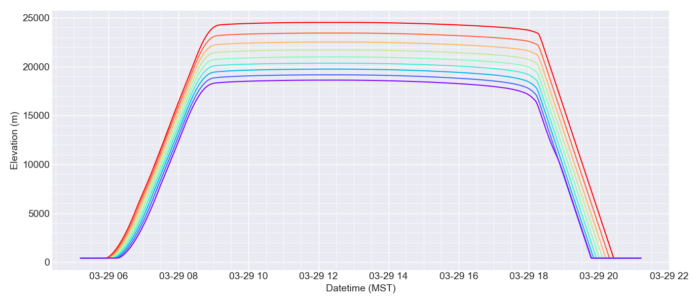
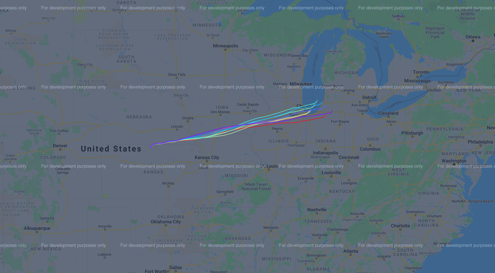

# EarthSHAB

Solar high altitude balloons (SHAB) are a simple and lightweight option for aerial exploration and meteorological data collection both terrestrially and on other planets. By using a
lightweight material that absorbs visual light and emits low levels of thermal radiation, solar balloons behave similarly to hot air balloons, but are capable of ascending to much higher altitudes. Unlike hot air balloons, which use a heat source to raise the temperature of the internal air, solar balloons generate heat by absorbing solar radiation, providing a free source of lift and eliminating the need for a lighter than air gas or carrying fuel.

EarthSHAB is an open source software platform for predicting the flight paths of solar balloon on Earth, adapted from [MarsSHAB](https://github.com/tkschuler/SolarBalloon), developed at the University of Arizona. Altitude profiles for a SHAB flight are generated using heat transfer modeling and dynamic analysis. By incorporating weather forecasts from NOAA, complete 3D SHAB trajectories can also be predicted.  

## Dependencies

EarthSHAB relies on the following libraries:

```
fluids
geographiclib
gmplot
netCDF4
numpy
pandas
termcolor
backports.datetime_fromisoformat
```

## Overview

**config_earth.py** includes adjustable parameters and default parameters for running any of the files discussed below. These parameters include balloon size, 
envelope material properties, deployment location, date and time, etc.

**saveNETCDF.py** downloads subsets of NOAA weather forecasts for offline simulation

**main.py**, **predict.py**, and **trapezoid.py** show examples of how to produce relevant and html-based trajectory maps using the Google maps API.


## Downloading Weather Forecasts

NOAA weather forecasts are downloaded from the [GrADS Data Server](https://nomads.ncep.noaa.gov/dods/) and saved locally in a [netcdf file format](https://www.unidata.ucar.edu/software/netcdf/docs/netcdf_introduction.html) to save computation time and have the ability to run trajectories offline.  At this time, archived weather forecasts are not supported.  

Forecasts are uploaded in 6 hour increments (starting with 00 UTC) and typically have a 4 hour upload delay. From the current date, forecasts can be downloaded up to 5 days in the past, and each forecast predicts up to 240 hours (10 days) in the future.

**saveNETCDF.py** is included for downloading a subset of the weather forecast locally. This script downloads geopotetial height and wind data for predicting horizontal movement of the balloons at a 0.25 degree lat/lon resolution and 3 hour temporal resolution.  At this time, atmospheric air temperature and pressure for predicting altitudes are from the [1969 US standard standard atmosphere](https://ntrs.nasa.gov/citations/19770009539), not the forecast.

Before running the script, update the following parameters **config_earth.py**:

```
gfs - Forecast start datetime and file name to be downloaded 
netcdf.lat_range - Subset of latitudes to download      (+/- .25 degrees increments)
netcdf.lon_range - Subset of longitudes to download     (+/- .25 degrees increments)
netcdf.hours3 - Number of 3 hour intervals to download  (+3 hour increments)
```

## Running Trajectory Predictions

Before running any predictions, make sure a forecast is downloaded and the proper *netcdf*, *simulation*, and *gfs* parameters are set in **config_earth.py**

*gfs.GFSRate* adjusts how often wind speeds are looked up (default is once per 60 seconds).  The maximum rate is 1 lookup per second, which provides the highest fidelity 
predictions, but also take significantly longer to process. Same with *dt* which is default to 3.0s for fastest simulation time but creates some
large osicillations in the altitude profile.  Most values above 3.0s cause the numerical integration to breakdown.  Reduce *dt* to 1s or lower to remove these 
oscillations, which will increase simulation time, but produce prettier plots.

**main.py** predict a solar balloon flight path given the parameters in the configuration file produces altitude and temperature plots as well as a flight prediction map.

Similarly, **predict.py** creates a heat map of possible trajectories at various float altitudes, shown in the two images below. It is difficult to manually adjust the float altitude 
with the current solar balloons model so this is done by adjusting the payload masses to get the right shape.  This script also generates a 3D wind rose and temperature profile
for the starting coordinate and timestamp

These scripts produce flight path maps using the Google Maps API, viewable in a browser via an HTML file.  The plot also highlights the forecast subset downloaded, as shown in the map
below; ensure that the trajectory stays within these bounds for accurate predictions. Otherwise adjust *netcdf.lat_range* and *netcdf.lon_range* and redownload the forecast.

*Note: At this time, trajectories that cross the international date line or the north or south poles are unsupported.  The vent dynamics are also unreliable; we need more vented 
flight data.*





**trapezoid.py** demonstrates how to use the GFS functionality with manual trajectories, independent of the solar balloon model.  Update *GNC.float* to predict trajectories at various altitudes. 

The scripts can be run with the default configuration file parameters and the included example forecast, *forecasts/gfs_0p25_20210329_12.nc*.

## Author

* **Tristan Schuler** - *U.S. Naval Research Laboratory, University of Arizona*

## Acknowledgments

Hat Tip to [Bovine Aerospace](https://bovineaerospace.wordpress.com/), who developed an initial solar balloon model in C++. This code was adapted from their [repo](https://github.com/tunawhiskers/balloon_trajectory).
