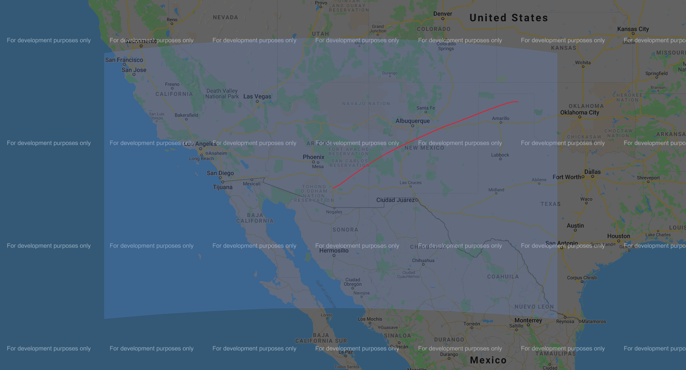

# EarthSHAB

Solar high altitude balloons (SHAB) are a simple and lightweight option for aerial exploration and meteorological data collection both terrestrially and on other planets. By using a
lightweight material that absorbs visual light and emits low levels of thermal radiation, solar balloons behave similarly to hot air balloons, but are capable of ascending to much higher altitudes. Unlike hot air balloons, which use a heat source to raise the temperature of the internal air, solar balloons generate heat by absorbing solar radiation, providing a free source of lift and eliminating the need for a lighter than air gas or carrying fuel.

EarthSHAB is an open source software platform for predicting the flight paths of solar balloon on Earth, adapted from [MarsSHAB](https://github.com/tkschuler/SolarBalloon), developed at the University of Arizona. Altitude profiles for a SHAB flight are generated using heat transfer modeling and dynamic analysis. By incorporating weather forecasts from NOAA, complete 3D SHAB trajectories can also be predicted.  

## Dependencies

EarthSHAB relies on the following libraries:

```
fluids
geographiclib
gmplot
netCDF4
numpy
pandas
termcolor
backports.datetime_fromisoformat
```

## Overview

This model is used to predict the trajectory of a solar high altitude balloon (SHAB) on Earth.

Parameters such as balloon size, envelope material properties, deployment location, date and time, etc. can all be adjusted in **config_earth.py** to perform simulations.  Update this file first. *Note: GFS time steps must be in 6 hour increments for downlading NOAA forecast data and can be run up to 10 days in the future.  Historical forecast data can be downloaded upto 5 days in the past using the DODS server.*  

Run **saveNETCDF.py** to download a more recent forecast from NOAA, or a different area.

Finally run **main.py** for an example of how to produce relevant plots as well as html-based trajectory maps using the Google maps API.


## Downloading Weather Forecasts

Current NOAA weather forecasts are downloaded from the [GrADS Data Server](https://nomads.ncep.noaa.gov/dods/) and saved locally in a [netcdf file format](https://www.unidata.ucar.edu/software/netcdf/docs/netcdf_introduction.html) to save computation time and have the ability to run trajectories offline.  At this time, archived weather forecasts are not supported.  

Forecasts are uploaded in 6 hour increments (starting with 00 UTC) and typically have a 4 hour upload delay. From the current date, forecasts can be downloaded up to 5 days in the past, and each forecast predicts up to 240 hours (10 days) in the future.

**saveNETCDF.py** is included for downloading a subset of the weather forecast locally. This script downloads geopotetial height and wind data for predicting horizontal movement of the balloons at a 0.25 degree lat/lon resolution and 3 hour temporal resolution.  At this time, atmospheric air temperature and pressure for predicting altitudes are from the [1969 US standard standard atmosphere](https://ntrs.nasa.gov/citations/19770009539), not the forecast.

Before running the script, update the following parameters **config_earth.py**:

```
nc_date - follow the example format and update for the current datetime
gfs_time - this datetime should match the filename
GFS.lat_range - Subset of latitudes to download   (+/- .25 degrees increments)
GFS.lon_range - Subset of longitudes to download  (+/- .25 degrees increments)
GFS.hour_index - Subset of timesteps to download  (+3 hour increments)
```

## Running a Trajectory

**main.py** reads in parameters from the configuration file to predict solar balloon flight paths and produces a 2D trajectory as well as altitude and temperature profiles.

*start_time* should be contained within the downloaded forecast, otherwise the program should throw an error message.

Additionally, **trajectory.py** is included as an example for predicting trajectories much faster.  This script uses a simple trapezoidal altitude profile based on historical 6m solar balloons flights (ascent speed: 2m/s, descent speed -3m/s).  Update *GNC.float* to predict trajectories at various altitudes. Both scripts produce a 2D trajectory using the google API, viewable in a browser.  The plot also highlights the forecast subset downloaded, as shown below; ensure that the trajectory stays within these bounds for accurate predictions, or adjust *GFS.lat_range* and *GFS.lon_range*.




*Note: At this time, trajectories that cross the international date line or the North or South poles are unsupported.  The vent dynamics are also unreliable; need more vented flight data.*

Both scripts can be run with the example forecast included, *gfs_0p25_20210223_12.nc*, and the configuration_file does not need to be adjusted.

## Author

* **Tristan Schuler** - *U.S. Naval Research Laboratory, University of Arizona*

## Acknowledgments

Hat Tip to [Bovine Aerospace](https://bovineaerospace.wordpress.com/), who developed an initial solar balloon model in C++. This code was adapted from their [repo](https://github.com/tunawhiskers/balloon_trajectory).
