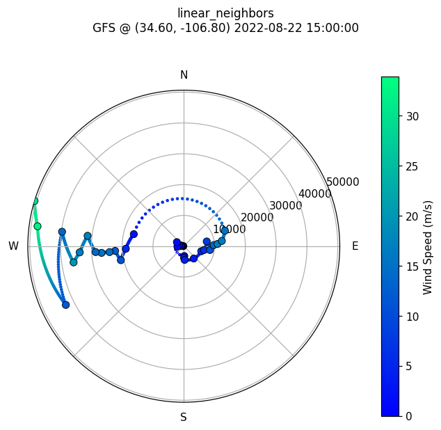
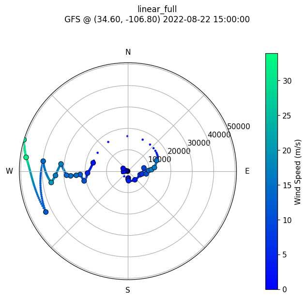

===========================
Wind Interpolation Methods
===========================

EarthSHAB's unified :class:`Forecast` reader (which serves both GFS and ERA5 netcdf
files) exposes three different methods for interpolating wind from the discrete
pressure levels of a forecast to the balloon's continuous altitude during
simulation. The active method is selected from a single config field:

.. code-block:: python

    # src/EarthSHAB/config_earth.py
    forecast = dict(
        file = "src/EarthSHAB/forecasts/gfs_0p25_20220822_12.nc",  # GFS or ERA5 .nc
        wind_interpolation = 'linear_full',     # see methods below
        ...
    )

All three methods are implemented in
:func:`EarthSHAB.Forecast.Forecast.wind_alt_Interpolate2`; the runtime dispatch
is driven by ``config_earth.forecast['wind_interpolation']``.

Methods
=======

``linear_neighbors`` (historical default)
-----------------------------------------

For the two pressure levels straddling the query altitude, convert the
sampled (u, v) winds to bearing + speed, then linearly interpolate the
*bearing* and the *speed* between those two levels (with a 0/360° wrap
correction so a wind shifting from 350° → 10° doesn't sweep the long way
around through 180°). The interpolated bearing/speed is then converted
back to (u, v).

- **Pros:** physically intuitive — speed and direction vary linearly.
  Matches a forecaster's mental model of how wind changes with altitude.
- **Cons:** the bearing → u/v conversion is non-linear, so the resulting
  u/v curve has subtle distortions near 0/360° crossings. Discards
  information from all the other pressure levels in the profile.

``linear_full``
---------------

Run ``numpy.interp`` independently on the **u** and **v** components
across the full altitude profile (all pressure levels at once), then sample
at the query altitude.

- **Pros:** simple, fast, no angle-wrap edge cases — u and v are
  ordinary scalars. Empirically the best-performing method in the
  EarthSHAB benchmark suite (see :ref:`evaluation-index`); the win
  comes from using the cartesian representation rather than from any
  fancier interpolation. Recommended as the new default.
- **Cons:** in regions where two adjacent pressure levels have opposing
  winds (a true wind shear layer), linear u/v interpolation smears the
  bearing through 90° in a way that isn't physically meaningful at
  intermediate altitudes — but the same smearing happens to the balloon
  in reality across a thin shear layer, so this is rarely a problem.

``spline_full``
---------------

Fit a ``scipy.interpolate.CubicSpline`` to **u** and **v** independently
across the full altitude profile, then sample at the query altitude.
The spline is built with ``extrapolate=False``; for query altitudes
outside the sampled range (typically *above* the highest pressure
level — the balloon often flies higher than the top GFS level), the
method falls back to ``numpy.interp`` (which clamps to the endpoint)
rather than letting the spline extrapolate, since unconstrained cubic
extrapolation overshoots wildly at the boundaries.

The helper also dedupes the input altitude array before fitting,
because :func:`EarthSHAB.Forecast.Forecast.fill_missing_data` clamps the top
few NaN entries to the last valid altitude, producing duplicate h
values that ``CubicSpline`` cannot handle. If fewer than four unique
altitudes remain after dedup, the helper transparently falls back to
linear interpolation.

- **Pros:** smooth derivatives — useful for visualization or for
  estimating wind shear (du/dh, dv/dh). Reproduces all sampled
  pressure-level winds exactly (within floating-point noise).
- **Cons:** can introduce small unphysical oscillations between
  sparsely-sampled pressure levels. In the EarthSHAB benchmark, spline
  wins *more individual launches* than linear_neighbors but its
  *mean landing error* is slightly worse than linear_full —
  the launches it hurts, it hurts harder than the launches it helps.

When to pick which
==================

- For trajectory prediction, prefer ``linear_full`` — it produced the
  lowest mean landing error in the 46-launch benchmark.
- For wind-shear analysis or visualization where smooth derivatives
  matter, use ``spline_full``.
- ``linear_neighbors`` is retained for bit-equivalent reproduction of
  pre-2026 EarthSHAB simulation results.

Visualizing the differences
===========================

The :class:`EarthSHAB.windmap.Windmap` class exposes
:func:`EarthSHAB.windmap.Windmap.plotWindMethod` which renders the same
3D polar windrose used by :func:`EarthSHAB.windmap.Windmap.plotWind2`
and :func:`EarthSHAB.windmap.Windmap.plotWindVelocity` — radius =
altitude, angle = bearing, color = wind speed — but interpolates the
wind profile using one of the three production methods exactly as the
simulator would consume it. A companion helper,
:func:`EarthSHAB.windmap.Windmap.plotWindMethodsComparison`, composes
all three into one side-by-side figure with shared color and radial
scales.

Example:

.. code-block:: python

    from EarthSHAB.windmap import Windmap
    import matplotlib.pyplot as plt

    wm = Windmap()
    wm.plotWindMethodsComparison(wm.hour_index, wm.LAT, wm.LON)
    plt.show()

The three polar windroses below show the same GFS profile interpolated
by each production method (large black-edged dots = raw pressure-level
samples; small dots = the dense interpolated samples the simulator
sees between pressure levels). Same color and radial scale across all
three for direct comparison.

|hodo_ln| |hodo_lf| |hodo_sp|

What to look for:

- **linear_neighbors** produces piecewise-linear arcs between adjacent
  pressure-level samples (bearing and speed each interpolated linearly,
  with 0/360° wrap correction). Other pressure levels in the profile
  are not consulted.
- **linear_full** interpolates u and v linearly across the *whole*
  profile. Near 0/360° crossovers the polar trace can take a longer
  arc than ``linear_neighbors`` because cartesian u/v interpolation
  passes through the origin rather than around it — visible as the
  curve dipping toward the center between two opposing-wind samples.
- **spline_full** threads smoothly through every pressure-level
  sample but visibly *overshoots* between sparsely-spaced ones — look
  for radial wobbles where the small dots momentarily leave and
  re-enter the corridor between adjacent black-edged samples. This
  overshoot is what hurts spline's mean landing error in the
  benchmark even though it wins more individual launches.

See also
========

- :doc:`Forecast` — unified forecast reader API
- :doc:`windmap` — windrose and hodograph plotting
- :ref:`evaluation-index` — batch evaluation comparing wind methods
