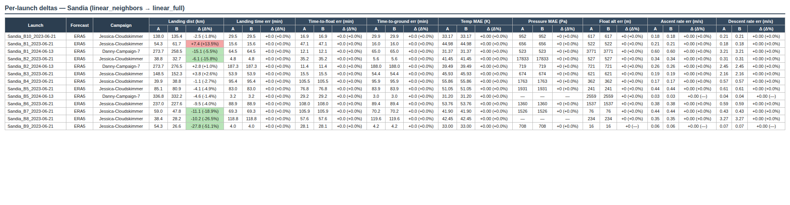
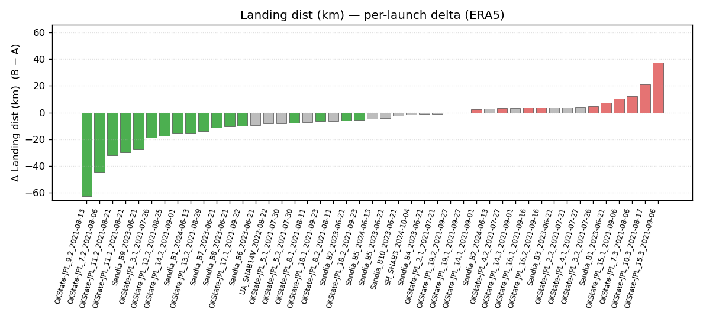
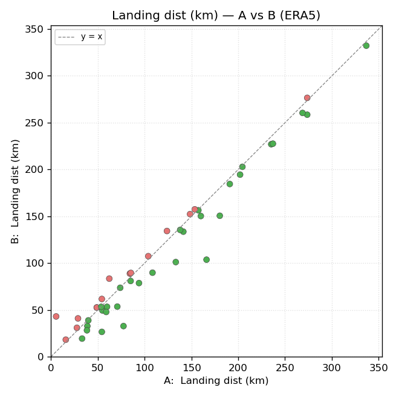

.. _batch-comparison:

========================
Batch Comparison
========================

``compare_batches`` can be used to determine: **did code or parameter changes make
trajectory sims better, worse, or different?**

Use two existing batches — A (baseline, "before") and
B (experiment, "after") — to produce an HTML report with per-launch
metric deltas, aggregates by forecast type and campaign, win/loss counts,
and overview bar + scatter plots for every metric. This builds on 
:ref:`batch-evaluation`: which runs a batch on the current codebase. 

.. note::

   The comparison is **pairwise** — exactly A vs B, not N-way. The sign
   convention is **Δ = B − A**, and every metric is a magnitude of
   error, so **negative Δ means improvement** (and is colored green).

Running a comparison
--------------------

.. code-block:: bash

   PYTHONPATH=src python -m evaluation.compare_batches <batch_A> <batch_B>

Both arguments accept either a full batch_id or just the short git hash:

.. code-block:: bash

   # full batch IDs
   python -m evaluation.compare_batches \
       2026-05-21T1510_96bcc3f \
       2026-05-21T1526_96bcc3f

   # short hashes (ambiguous hashes will error out)
   python -m evaluation.compare_batches 96bcc3f 4afc699

Self-comparison (``compare_batches X X``) is allowed and useful as a
sanity check — every delta should be zero.

Comparison output folder
------------------------

Each comparison writes a self-contained folder next to ``batches/``:

.. code-block:: text

   evaluation/comparisons/
   └── 2026-05-21T2004_96bcc3f_vs_96bcc3f/
       ├── compare.html                                ← the report
       ├── plot_landing_distance_km_GFS_bar.png        ← per-launch Δ bar chart
       ├── plot_landing_distance_km_GFS_scatter.png    ← A-vs-B scatter
       ├── plot_landing_distance_km_ERA5_bar.png
       ├── plot_landing_distance_km_ERA5_scatter.png
       ├── plot_landing_time_diff_min_GFS_bar.png
       ├── ...                                         ← ~40 plots total

Two PNGs per metric per forecast type. The HTML embeds the plots by
relative path so the folder is portable.

HTML report
-----------

The example below is the per-launch detail table from the linear_neighbors → linear_full
comparison, filtered to the Sandia launches. Each metric occupies three sub-cells
(``A | B | Δ``), and Δ cells are colored only when the change clears both the
absolute and percent thresholds — green for improvement, red for regression,
gray for "within noise". Metrics that don't depend on wind interpolation
(time-to-float, temp MAE, ascent rate, etc.) stay at "+0.0 (+0.0%)" across the
board, which is itself a useful sanity check.

|cmp_html|

The report opens with a **summary** block — 5–7 lines covering the headline
metrics (landing distance, landing time error, float altitude error) to
see whether the change helped or hurt.

Below the summary:

* **ASYMMETRIES** section — launches present in only one batch, or that
  failed in one but succeeded in the other. These are listed separately
  so they cannot quietly skew aggregate metrics.
* **Overall summary** — mean(A) | mean(B) | Δ | Δ% per metric across the
  intersection of both batches, plus a win/loss count line per metric
  (e.g. *"28 improved / 5 unchanged / 13 worse"*).
* **Per-forecast aggregates** — same layout broken out by GFS and ERA5.
* **Per-campaign aggregates** — one block per campaign that appears in
  both batches.
* **Per-launch detail table** — three sub-cells per metric (``A | B | Δ``),
  colored by improvement direction.
* **Reforecast diagnostics** (GFS only) — a separate section for the
  ``reforecast_landing_dist_m`` metric, which isolates wind-forecast
  error from altitude-model error.

A cell is **only colored** if both ``|Δ| > metric_abs_floor`` and
``|Δ%| > 5%``. Cells below either threshold stay gray — this avoids
calling tiny noise an "improvement". Per-metric absolute floors are
defined as constants at the top of ``evaluation/compare_batches.py``.

Overview plots
--------------

For each of the comparison's metrics, two plots are generated per
forecast type:

* a **per-launch bar chart** of signed Δ (B − A), sorted by Δ, and
* an **A-vs-B scatter** with a y=x reference line.

Both use the same green / gray / red color convention as the HTML cells.
The bar-chart Y-axis is shared between the GFS and ERA5 versions of the
same metric, so you can flip between them and directly compare scale.

The example below is from the 46-launch comparison of the historical
``linear_neighbors`` wind-interpolation method (A) against the new
``linear_full`` method (B) introduced in v1.4. See
:doc:`../API/wind_interpolation` for what those methods are.

**Per-launch Δ bar chart — landing distance, ERA5:**

|cmp_bar|

**A-vs-B scatter — same metric, same forecast:**

|cmp_scatter|

Asymmetries
-----------

A launch may be missing from one side for several reasons:

* It was added (or removed) from ``launches.json`` between the two batch
  runs.
* One run failed for that launch (network error, missing forecast file,
  evaluator exception) while the other succeeded.
* The launch has both GFS and ERA5 in one batch but only one of them in
  the other.

These cases are split out into a top-level **ASYMMETRIES** block and
**excluded from the intersection-based aggregates**, so the headline
"mean Δ" numbers stay apples-to-apples. The asymmetry block lists
the affected launches with the reason for each.

Schema drift — a metric column that exists in one batch but not the
other — is silently dropped from the comparison with a warning banner
at the top of the HTML.
