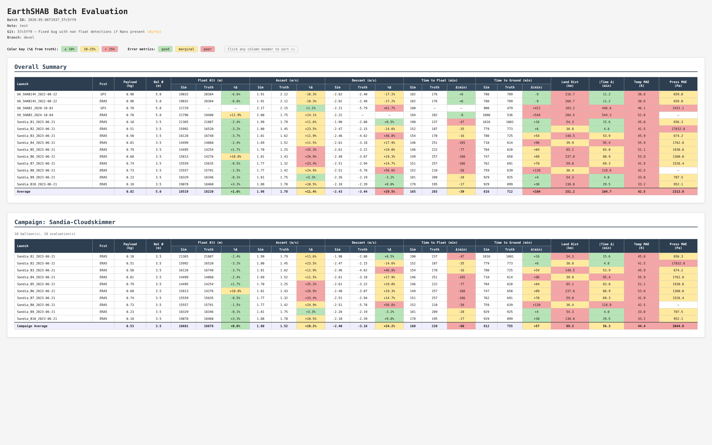

.. _batch-evaluation:

========================
Batch Evaluation
========================

The batch evaluator runs the full library of historical balloon launches in
``evaluation/launches.json`` against the **current state of the codebase**, tags
the results with the current git hash, and writes everything — metrics CSV,
interactive HTML report, per-launch comparison plots, and trajectory maps —
into a self-contained timestamped folder.

Useful for:

* establishing a **baseline** before changing the model or tuning hyperparameters,
* measure the **effect of a code change** across many flights at once,

Every batch is reproducible from ``batch_info.json`` (git hash, branch, commit
message, and a snapshot of ``launches.json`` are all stored alongside the
results).

For a single-flight workflow with finer-grained per-flight tuning, see
:ref:`single-evaluation`.  All assumptions in
:ref:`single-evaluation-assumptions` (phase detection, smoothing, NaN handling,
reforecast construction, sunset detection) apply identically to batch runs —
each launch is processed by the exact same :py:class:`evaluation.evaluate.BalloonEvaluator`.

System Overview
---------------

The system lives entirely in the ``evaluation/`` directory:

.. list-table::
   :widths: 35 65
   :header-rows: 1

   * - File
     - Purpose
   * - ``evaluation/launches.json``
     - Master metadata file — one entry per historical launch
   * - ``evaluation/launches.example.json``
     - Template you can copy to bootstrap your own ``launches.json``
   * - ``evaluation/run_batch.py``
     - Runs all launches and writes a timestamped batch folder
   * - ``tests/test_validate_launches.py``
     - Auto-parametrized validation that every file referenced in ``launches.json`` exists and is correctly formatted

Step 1 — Populate ``launches.json``
-------------------------------------

``launches.json`` is the single source of truth for all historical flights.
Each entry describes one balloon launch and points to its trajectory and
forecast files.

**Required fields** (the batch will skip the launch if any are missing):

.. list-table::
   :widths: 30 15 55
   :header-rows: 1

   * - Field
     - Type
     - Description
   * - ``shab_name``
     - string
     - Balloon identifier (e.g. ``"SHAB14V"``)
   * - ``organization``
     - string
     - Launching organization (e.g. ``"UA"``, ``"NRL"``, ``"JPL"``)
   * - ``launch_time``
     - string
     - UTC launch time in ISO format: ``"2022-08-22 14:36:00"``
   * - ``sim_time_hr``
     - number
     - Simulation duration in hours.  **Set this manually** — APRS trackers often lose signal near the ground at launch and landing, so auto-detection is unreliable.  Pad by 1–2 hours past expected landing.
   * - ``aprs_file``
     - string
     - Filename only (e.g. ``"SHAB14V-APRS.csv"``).  File must exist in ``balloon_data/``.
   * - ``launch_lat``
     - number
     - Launch latitude in decimal degrees
   * - ``launch_lon``
     - number
     - Launch longitude in decimal degrees
   * - ``launch_alt_m``
     - number
     - Ground elevation at launch site in meters (also used as ``min_alt`` for landing detection)
   * - ``payload_weight_kg``
     - number
     - Payload mass in kg
   * - ``envelope_weight_kg``
     - number
     - Envelope mass in kg
   * - ``balloon_shape``
     - string
     - ``"sphere"``
   * - ``balloon_size``
     - number
     - Balloon diameter in meters (sphere) or characteristic length (trapezoid)
   * - ``gfs_file`` and/or ``era5_file``
     - string
     - Forecast filename (e.g. ``"gfs_0p25_3h_20220822_12.nc"``).  At least one is required; set the other to ``null`` if not available.

**Optional fields** (fall back to current ``config.py`` defaults if omitted):

``callsign``, ``campaign``, ``landing_time``, ``launch_type``,
``areaDensityEnv``, ``cp``, ``absEnv``, ``emissEnv``, ``Upsilon``, and any
``earth_properties`` field (``Cp_air0``, ``Cv_air0``, ``Rsp_air``, ``P0``,
``emissGround``, ``albedo``).

.. tip::
    When the ``campaign`` field is included, the HTML report groups all
    launches that share a campaign name into their own sub-table with its own
    campaign-average row (see :ref:`batch-html-summary`).

.. _launch-types:

Launch Types
~~~~~~~~~~~~

The optional ``launch_type`` field describes how the SHAB got off the ground.
EarthSHAB's solar-balloon physics model only describes a self-ascending
solar balloon, so for non-standard deployments the ascent metrics are not
meaningful — see the rules below.

.. list-table::
   :widths: 22 78
   :header-rows: 1

   * - Value
     - Meaning
   * - ``"standard"`` (default)
     - Conventional ground release — SHAB ascends under solar buoyancy alone.
       Full ascent / float / descent metrics are scored.
   * - ``"helium_augmented"``
     - SHAB is partially filled with helium so that buoyancy carries it up
       faster than solar heating alone could.  Float and descent are still
       physically comparable to the model, but the helium-driven ascent rate
       is not — **ascent metrics are reported as N/A** for these flights.
   * - ``"grand_slam"``
     - SHAB is carried aloft by a separate weather balloon and released
       *above* its natural float altitude.  After release, the SHAB
       *descends* through the air column until it reaches its float, then
       floats normally before landing.

       For Grand Slam two evaluator behaviours change:

       * **Ascent metrics are reported as N/A** (the carry-up is not the
         model's ascent).
       * The float-detection bracket is widened from "near peak altitude"
         to the **entire post-apex region of the trajectory**.  Without this
         the detector would clip to the brief weather-balloon release
         plateau and miss the actual SHAB float that follows the descent.

If the field is omitted, the evaluator behaves as if it were ``"standard"``.
The ``compare_batches.py`` and ``summary.html`` reports include a ``Type``
column so you can see at a glance which model assumption was applied to
each row.

.. note::
   ``launch_type`` does **not** change the forward simulation itself —
   EarthSHAB still simulates a self-ascending solar balloon either way.
   The flag only changes which phase metrics are scored against ground
   truth, so non-physical comparisons don't pollute the per-campaign
   averages.

**Example entry:**

.. code-block:: json

   {
     "shab_name": "SHAB14V",
     "organization": "UA",
     "callsign": "SHAB14V",
     "campaign": "Schuler-ABQ",
     "launch_time": "2022-08-22 14:36:00",
     "landing_time": null,
     "sim_time_hr": 14,
     "aprs_file": "SHAB14V-APRS.csv",
     "gfs_file": "gfs_0p25_3h_20220822_12.nc",
     "era5_file": "SHAB14V_ERA5_20220822_20220823.nc",
     "launch_lat": 34.60,
     "launch_lon": -106.80,
     "launch_alt_m": 1000.0,
     "payload_weight_kg": 0.9,
     "envelope_weight_kg": 2.1,
     "balloon_shape": "sphere",
     "balloon_size": 5.8
   }

.. note::

   If a launch has both a GFS and an ERA5 forecast file, the batch runner will
   produce **two separate evaluations** — one per forecast type — in the same
   launch output folder.  Both rows appear independently in ``summary.csv``
   and ``summary.html``.

Step 2 — Validate Before Running
----------------------------------

Before running a batch, check that all referenced files exist and are correctly
formatted:

.. code-block:: bash

   pytest tests/test_validate_launches.py --spec

The tests are **auto-parametrized** — adding a new launch to ``launches.json``
instantly adds a full set of validation tests for it.

Step 3 — Run a Batch
----------------------

Run all launches against the **current codebase state**:

.. code-block:: bash

   python -m evaluation.run_batch --note "baseline evaluation"

The ``--note`` flag is **required**.  Use it to describe what changed since the
last batch (e.g. ``"tuned Upsilon coefficient"``).  The note is stored with the
results so you can remember why each batch was run.

The runner will:

1. Detect the current git hash, branch, commit message, and dirty flag
2. Snapshot the original ``config`` state (so per-launch overrides cannot
   bleed into each other)
3. Create a timestamped output folder: ``evaluation/batches/2026-04-28T1423_a3f9c12/``
4. For each launch in ``launches.json``:

   * validate required fields and file paths,
   * build a complete config-override dict for each forecast type the launch
     supports,
   * run a GFS evaluation and/or an ERA5 evaluation,
   * write per-launch CSV / PNG / interactive HTML map outputs,
   * append one summary row per forecast type
5. Skip failed launches with a full traceback printed to the console — the
   batch always continues
6. Write ``summary.csv``, ``summary.html``, and ``batch_info.json`` at the batch
   level

**Console output example:**

.. code-block:: text

   ============================================================
     EarthSHAB Batch Evaluation
     Batch ID : 2026-04-28T1423_a3f9c12
     Note     : baseline evaluation
     Launches : 2
   ============================================================

   ── UA_SHAB14V_2022-08-22 ──
     Running GFS...
     [GFS] done

     Running ERA5...
     [ERA5] done

   ── UA_SHAB1_2020-10-01 ──
     Running GFS...
     [GFS] done

   Summary → evaluation/batches/2026-04-28T1423_a3f9c12/summary.csv
   Report  → evaluation/batches/2026-04-28T1423_a3f9c12/summary.html
   Batch info → evaluation/batches/2026-04-28T1423_a3f9c12/batch_info.json

   ============================================================
     Batch complete: 2/2 launches succeeded
     Total runtime: 142.3s
   ============================================================

Output Structure
-----------------

Each batch produces a self-contained folder:

.. code-block:: text

   evaluation/batches/
   └── 2026-04-28T1423_a3f9c12/
       ├── batch_info.json           ← git hash, note, runtime, launch status, launches.json snapshot
       ├── summary.csv               ← all metrics, one row per launch × forecast type
       ├── summary.html              ← interactive sortable, color-coded report
       ├── UA_SHAB14V_2022-08-22/
       │   ├── SHAB14V-APRS_GFS_2022_8_22.csv
       │   ├── SHAB14V-APRS_GFS_2022_8_22.png
       │   ├── EVALUATION_SHAB14V-APRS_GFS_2022_8_22.html
       │   ├── SHAB14V-APRS_ERA5_2022_8_22.csv
       │   ├── SHAB14V-APRS_ERA5_2022_8_22.png
       │   └── EVALUATION_SHAB14V-APRS_ERA5_2022_8_22.html
       └── UA_SHAB1_2020-10-01/
           ├── SHAB1-APRS_GFS_2020_10_1.csv
           ├── SHAB1-APRS_GFS_2020_10_1.png
           └── EVALUATION_SHAB1-APRS_GFS_2020_10_1.html

**``batch_info.json``** records everything needed to reproduce or understand the batch:

.. code-block:: text

   {
     "batch_id": "2026-04-28T1423_a3f9c12",
     "note": "baseline evaluation",
     "git_hash": "a3f9c12",
     "git_branch": "devel",
     "git_commit_message": "Added batch evaluator",
     "git_dirty": false,
     "earthshab_version": "1.3",
     "total_runtime_s": 142.3,
     "per_launch_avg_runtime_s": 71.15,
     "launches_attempted": ["UA_SHAB14V_2022-08-22", "UA_SHAB1_2020-10-01"],
     "launches_succeeded": ["UA_SHAB14V_2022-08-22", "UA_SHAB1_2020-10-01"],
     "launches_failed": {},
     "launches_json_snapshot": { ... full launches.json ... }
   }

.. note::
   ``git_dirty: true`` means there were uncommitted changes when the batch ran.
   Results from dirty batches should be treated as exploratory — commit your
   changes before a batch you intend to keep.

.. _batch-html-summary:

Batch Summary Table
--------------------------------------

|eval_html|

**Header**

The report header echoes the batch metadata — batch ID, note, git hash /
commit message (with a dirty flag when applicable), branch — and the batch
**runtime**: total wall-clock seconds plus the per-launch average.

**Tables**

The page always contains an **Overall Summary** table covering every launch ×
forecast pair in the batch.  In addition, every distinct value of the optional
``campaign`` field becomes its own **Campaign sub-table** below — but only if
the campaign contains at least 2 distinct balloons (single-flight campaigns
are suppressed to avoid noise).  Each campaign sub-table has its own
*Campaign Average* footer row.

**Columns**

Each row represents one launch × one forecast type.  Columns are grouped:

.. list-table::
   :widths: 22 78
   :header-rows: 1

   * - Group
     - Columns
   * - Identity
     - ``Launch``, ``Fcst`` (GFS / ERA5), ``Type`` (see :ref:`launch-types`), ``Payload (kg)``, ``Bal Ø (m)``
   * - Float Alt (m)
     - ``Sim``, ``Truth``, ``%Δ`` (signed percentage difference Sim vs Truth)
   * - Ascent (m/s)
     - ``Sim``, ``Truth``, ``%Δ`` — **N/A for ``helium_augmented`` and ``grand_slam`` rows** (the model's solar-ascent physics does not apply when buoyancy is augmented or the SHAB is carried up by a weather balloon)
   * - Descent (m/s)
     - ``Sim``, ``Truth``, ``%Δ``
   * - Time to Float (min)
     - ``Sim``, ``Truth``, ``Δ(min)`` (signed minutes, sim − truth)
   * - Time to Ground (min)
     - ``Sim``, ``Truth``, ``Δ(min)``
   * - End-to-end errors
     - ``Land Dist (km)`` great-circle landing miss, ``|Time Δ|`` (min, absolute landing-time miss), ``Temp MAE (K)``, ``Press MAE (Pa)``

The averages footer row shows the column-wise mean of all *successful* rows.
Failed launches are shown as a single full-width red row with the failure
message and are pinned to the bottom of any sort.

**Color coding**

The color rules differ between *percent-difference* cells and
*absolute-error* cells:

.. list-table::
   :widths: 30 15 25 30
   :header-rows: 1

   * - Cell type
     - Green (≤)
     - Yellow (≤)
     - Red (>)
   * - ``%Δ`` columns (Float / Ascent / Descent)
     - 10 %
     - 25 %
     - 25 %
   * - Time-to-float diff (min, abs)
     - 15
     - 45
     - 45
   * - Time-to-ground diff (min, abs)
     - 30
     - 90
     - 90
   * - Land Dist (km)
     - 20
     - 50
     - 50
   * - \|Time Δ\| (min, abs)
     - 30
     - 90
     - 90
   * - Temp MAE (K)
     - 5
     - 15
     - 15
   * - Press MAE (Pa)
     - 500
     - 2000
     - 2000

Cells with no value (NaN, missing, etc.) display as ``—`` and are uncolored.

.. tip::

    **Sorting**: Click any column header to sort that column's data. Failed-row entries 
    always sort to the bottom regardless of direction.
