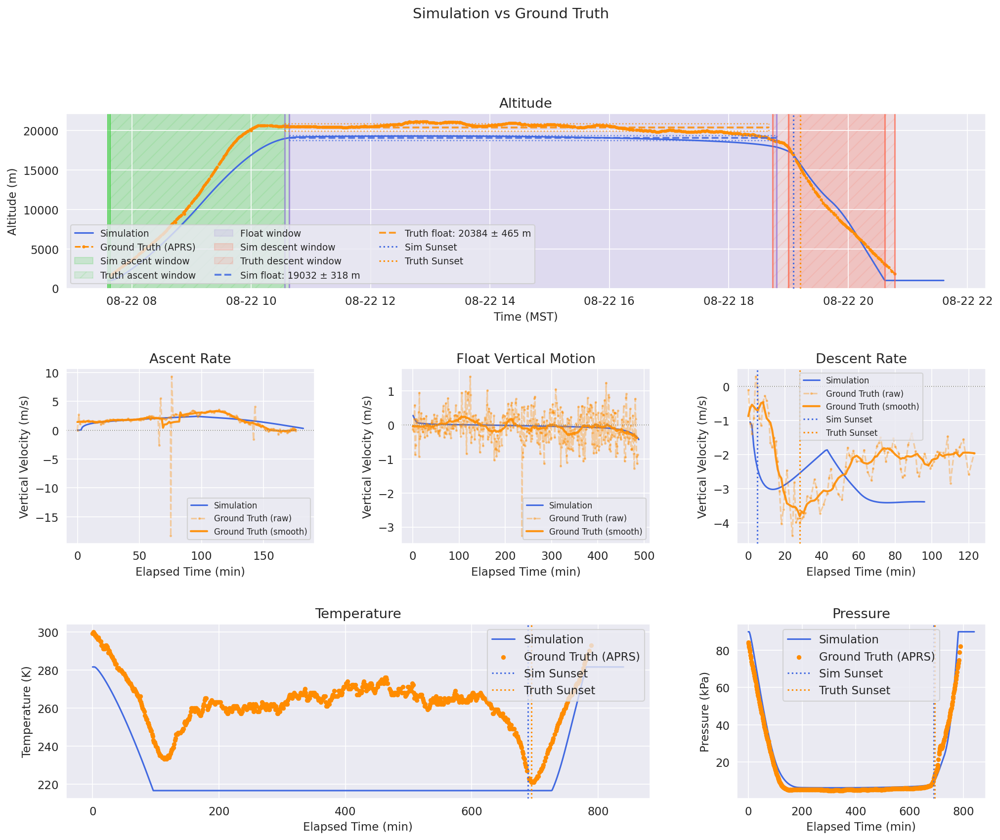

.. _single-evaluation:

====================
Single Evaluation
====================

A single evaluation runs **one** simulation against **one** historical balloon
flight and reports how close the simulation came to the truth.  It uses the
current ``config_earth.py`` directly.

Useful for:

* Comparing an individual ground truth SHAB flight trajectory to the EarthSHAB model, with GFS or ERA5
* tuning single physical parameters (``Upsilon``, interpolation methods, emissivity, etc.)

For batch evaluating multiple flights and campaigns, see :ref:`batch-evaluation`.

Prerequisites
-------------

Two required inputs must be in place before running the evaluation, with SHAB14V as an example:

1. **A downloaded forecast file** (GFS or ERA5) in ``src/EarthSHAB/forecasts/``.
2. **A balloon trajectory CSV** in ``src/EarthSHAB/balloon_data/SHAB14V-APRS.csv``.

.. note::
   Trajectory CSVs can be downloaded after landing from
   `APRS.fi <https://aprs.fi>`_ and LightAPRS-W trajectory .csv formats are accepted. More coming soon.
   The trajectory loader auto-detects the format from the column header.

Configure ``config_earth.py``
-----------------------------

**1. Point to your APRS trajectory file:**

.. code-block:: python

   balloon_trajectory = parent_dir + "balloon_data/SHAB14V-APRS.csv"

**2. Set the simulation start time to match launch:**

.. code-block:: python

   start_time = datetime.fromisoformat("2022-08-22 14:36:00")  # UTC

**3. Set the launch coordinates and ground elevation:**

.. code-block:: python

   simulation = dict(
       start_time = start_time,
       sim_time = 15,        # hours — set 1–2 hours beyond actual flight duration
       start_coord = {
           "lat": 34.60,
           "lon": -106.80,
           "alt": 1000.,     # ground elevation (m), also used as min_alt
           "timestamp": start_time,
       },
       min_alt = 1000.,
       balloon_trajectory = balloon_trajectory,
       ...
   )

**4. Set balloon physical properties:**

.. code-block:: python

   balloon_properties = dict(
       shape = 'sphere',
       d = 5.8,        # diameter (m)
       mp = 0.9,       # payload mass (kg)
       mEnv = 2.1,     # envelope mass (kg)
       ...
   )

**5. Select your forecast file:**

.. code-block:: python

   forecast = dict(
       file = "src/EarthSHAB/forecasts/gfs_0p25_20220822_12.nc",  # GFS or ERA5 .nc
       forecast_start_time = "2022-08-22 12:00:00",
       forecast_update_interval = 60,
   )

The source (GFS vs ERA5) is read automatically from the file's ``institution``
attribute — point ``file`` at the bundled ERA5 forecast
(``SHAB14V_ERA5_20220822_20220823.nc``) to evaluate the same flight off ERA5.

Run the Evaluation
------------------

From the repository root:

.. code-block:: bash

   python -m evaluation.evaluate

The single evaluator does three steps:

1. **Forward simulation** — runs the full physics-based trajectory prediction 
   using the provided forecast (same as `main.py` and `predict.py`)
2. **Reforecast simulation** — re-runs the same flight, but instead of using the
   simulated altitude profile, it forces the balloon onto the *actual 
   altitude profile* and only uses the forecast for horizontal winds.  This
   isolates **wind error** from **vertical-motion error**.
3. **Cross-comparison metrics** — phase detection, float statistics, landing
   distance, temperature/pressure MAE. and outputs a statistics table,
   multi-panel comparison PNG, and an interactive trajectory HTML.

Single Evaluation Output
------------------------

**Console report:**

.. code-block:: text

   ====================================================================
     EarthSHAB Evaluation: SHAB14V-APRS
   ====================================================================
     Metric                               Sim      Truth       Diff  Unit
   --------------------------------------------------------------------
     Float Alt Mean (m)                 18988      20396      -1407  m
     Float Alt Std (m)                    378        447        -69  m
     Ascent Rate Mean (m/s)              1.91       2.36      -0.45  m/s
     Ascent Rate Std (m/s)               0.33       0.96      -0.63  m/s
     Descent Rate Mean (m/s)            -2.82      -2.37      -0.44  m/s
     Elapsed Time (min)                 779.8      789.0       -9.3  min
     Landing Lat (°)                  34.7816    34.5468     0.2347  °
     Landing Lon (°)                -106.7869  -109.1340     2.3471  °
   --------------------------------------------------------------------
     Distance Off (m)                                        216697  m
     Landing Time (MST)  2022-08-22 20:35   2022-08-22 20:46  -11.2  min
   --------------------------------------------------------------------
     Temperature MAE                                          38.55  K
     Pressure MAE                                               659  Pa
   --------------------------------------------------------------------
     GFS Forecast + Truth Altitude (reforecast landing vs truth)
     Distance Off (m)                                         44811  m
   ====================================================================

   Start-time analysis
   Current config start_time : 2022-08-22 14:36:00 UTC
   First APRS transmission   : 2022-08-22 14:37:53 UTC  (1557 m)
   Estimated launch time     : 2022-08-22 14:32:23 UTC
   Suggested start_time      : "2022-08-22 14:32:23"

.. tip::
   The **start-time analysis** at the bottom takes the first ascending APRS
   points (``v > 0.5 m/s``), averages their vertical velocity, and linearly
   extrapolates the first APRS altitude back down to ``min_alt``.  If the
   suggested time differs significantly from your configured ``start_time``,
   update ``config_earth.py`` and re-run.  APRS trackers often miss the begining
   of ascent due to ground interference.

**Comparison plot:**

|eval_single_plot|

*  **Altitude Profile**.  EarthSHAB Simulated trajectory in blue, APRS
   ground truth in orange.  Colored bounding boxesshow the detected phase
   windows for sim (solid fill) and truth (hatched fill):

   * green   = ascent window
   * purple  = float window
   * red     = descent window

   The float-altitude estimate is overlaid as a horizontal mean line bracketed
   by ±1 σ rails.  Sim sunset (blue dotted) and truth sunset (orange dotted)
   appear at the wall-clock instant the solar zenith first crosses 90°
   (refraction-adjusted) along each trajectory.

*  **Row 2 — Per-phase velocity windows**.  Three subplots zoomed to the
   ascent / float / descent phase respectively.  Each subplot uses
   *phase-aligned elapsed time* on the x-axis so sim and truth align
   even when their wall-clock phase boundaries do not match.  Truth velocity
   is drawn twice: faded markers for the raw finite-difference signal and a
   solid line for the rolling-mean smoothed version.

*  **Row 3 — Temperature and Pressure**.
   Sim ``T_atm`` vs onboard sensor; sim altitude → ISA pressure vs onboard
   barometer.  X-axis is elapsed time for both traces, allowing
   visual comparison even if launch wall-clock times differ slightly.

**Saved files** (written to ``evaluation/``):

.. list-table::
   :widths: 50 50
   :header-rows: 1

   * - File
     - Contents
   * - ``<stem>.csv``
     - All metrics in tabular form (Sim, Truth, Diff)
   * - ``<stem>.png``
     - Three-row comparison figure shown above
   * - ``EVALUATION_<stem>.html``
     - Interactive trajectory map (Google Maps): simulated trajectory, reforecast trajectory, and APRS ground-truth track on a single map

The filename ``stem`` is built from the trajectory name, forecast type, and
launch date — e.g. ``SHAB14V-APRS_GFS_2022_8_22``.

.. _single-evaluation-assumptions:

Calculations and Assumptions
----------------------------

Phase detection (ascent / float / descent)
~~~~~~~~~~~~~~~~~~~~~~~~~~~~~~~~~~~~~~~~~~

Implemented in :py:meth:`~evaluation.evaluate.BalloonEvaluator._detect_phases`.

The detector runs the same algorithm against both the simulation and the truth
trajectory.  The goal is a robust three-way segmentation that survives noisy
APRS data and survives "no float" trajectories where the balloon peaks and
immediately falls.

Step 1 — locate the high-altitude region
   The maximum altitude is taken with ``np.nanmax`` (so a single dropped APRS
   altitude reading does not collapse the detector).  Indices where
   ``alt ≥ 0.90 · max_alt`` define the high-altitude bracket
   ``[i_enter, i_exit]``.  NaN altitudes evaluate ``False`` and are naturally
   excluded.  If no point qualifies, ``i_enter = i_exit = argmax(alt)``.

Step 2 — find the float window inside the bracket
   The vertical velocity is smoothed with a centred rolling mean.  Window size
   is ``max(10, min(span // 6, 600))`` where ``span = i_exit − i_enter``, so it
   adapts to the length of the high-altitude region but is capped to avoid
   trivial smoothing on long flights.

   The candidate float mask is ``|rolling-mean v| < v_float`` (default
   ``v_float = 1.0 m/s``).  Of all contiguous True blocks, the **largest** is
   chosen.  It is then **rejected** if it is shorter than ``max(10, span // 4)``
   — this rejects spurious float detections caused by the velocity zero-crossing
   at the apex of a "straight up, straight down" trajectory.

Step 3 — trim the float window
   Even after thresholding, the start of the candidate block contains the
   *deceleration into float* (rolling mean still > 0.3 m/s) and the end contains
   the *rapid descent out of float* (rolling mean < −0.5 m/s).  The block is
   trimmed inward until the rolling mean satisfies these tighter bounds.  If
   trimming destroys the block (length < ``min_len``), the float is discarded.

Step 4 — ascent and descent
   Ascent and descent masks live strictly **outside** the high-altitude bracket
   to keep them clear of the curved transition regions:

   * ``ascent_mask  = (v > v_linear) & (i < i_enter)``
   * ``descent_mask = (v < −v_linear) & (i ≥ i_exit)``

   ``v_linear`` defaults to ``1.0 m/s``.

Launch-type-aware behaviour
~~~~~~~~~~~~~~~~~~~~~~~~~~~

EarthSHAB only physically models a self-ascending solar balloon.  When the
``launch_type`` field on a launch entry is set to something other than
``"standard"``, the evaluator alters phase detection and metric reporting so
non-physical comparisons don't pollute the results.  The behaviour is
identical between single and batch evaluations.

* ``"standard"`` (default) — full ascent / float / descent metrics.
* ``"helium_augmented"`` — ascent is helium-driven, faster than solar.
  **Both sim and truth ascent masks are zeroed out**, so ``Ascent Rate Mean
  / Std`` and ``Time to Float`` report ``N/A``.  Float and descent metrics
  remain valid and are scored.
* ``"grand_slam"`` — SHAB is carried by a separate weather balloon and
  released *above* its natural float altitude.  Two changes:

  * Ascent metrics are zeroed (same as helium-augmented).
  * The float-search bracket is widened from ``alt ≥ 0.90 · max_alt`` to
    the **entire post-apex region of the trajectory**.  Without this the
    detector clips to the brief weather-balloon release peak and misses the
    actual SHAB float plateau that follows the descent.  The descent mask
    then begins at ``last_float_index + 1``.

A row's ``Type`` cell in :ref:`batch-html-summary` shows which behaviour
was applied; missing field is treated as ``standard``.

.. note::
   The forward simulation is unchanged — EarthSHAB still simulates a solar
   balloon ascending from ``min_alt`` regardless of ``launch_type``.  The
   flag only affects which phases of the *observed* trajectory get scored.

Truth-velocity smoothing
~~~~~~~~~~~~~~~~~~~~~~~~

Before phase detection, the truth velocity is passed through a **5-sample centred 
rolling median** (``min_periods=1``).  The unsmoothed (raw) velocity is shown as
faded markers.  The smoothed version (solid line) is used in the
phase detector and the truth ascent/descent rate metrics.

NaN handling
~~~~~~~~~~~~

* **Phase detection**: ``np.nanmax`` and ``np.nanargmax`` for altitude;
  ``alt >= threshold`` evaluates ``False`` on NaN, so NaN points cannot leak
  into the high-altitude bracket.
* **Trajectory map**: ``_drop_nan_coords`` filters any ``(lat, lon)`` pair where
  either coordinate is NaN before the polyline is drawn.  This stops gmplot from
  drawing a line through ``(0, 0)``.

Altitude "Reforecast" (truth altitude profile + forecasted wind)
~~~~~~~~~~~~~~~~~~~~~~~~~~~~~~~~~~~~~~~~~~~~~~~~~~~~~~~~~~~~~~~~~~~~~~~~~

The **reforecast landing distance** removes the vertical-motion error, showing the 
balloon trajectory had it flown the *exact* altitude profile but in the *forecast* wind field.

1. The forecast is queried at each trajectory point ``(time, lat, lon, alt)`` to get the
   forecasted wind vector ``(u, v)`` that would have acted on the balloon at that instant.
2. The wind is integrated forward in time using the *ground-truth* altitude profile
   (no buoyancy, no envelope dynamics), producing a **reforecasted trajectory**.

Onboard temperature & pressure
~~~~~~~~~~~~~~~~~~~~~~~~~~~~~~

* ``Temperature MAE`` — the simulated atmospheric temperature ``T_atm`` is
  linearly interpolated to each APRS timestamp and compared against the parsed
  onboard temperature, in kelvin.
* ``Pressure MAE`` — the **ISA-1976** pressure model is evaluated at each APRS
  altitude and compared against the parsed onboard barometer reading, in pascals.
  This is a sanity check on the APRS pressure sensor and on the altitude
  estimate, **not** on the simulator.

Both metrics report ``N/A`` if no parseable readings exist.

Sunset detection
~~~~~~~~~~~~~~~~

Sunset for sim and truth is computed independently:

* **Sim sunset**: scans every 60 sim steps; converts local time to UTC using the
  configured GMT offset and tests
  ``solar_zenith_adjusted(t_utc, lat, lon, alt) ≥ π/2``.  The first crossing
  is the sunset.
* **Truth sunset**: same test, but using each APRS row's actual lat/lon/altitude
  and the row timestamp.  Crucially, the APRS dataframe is sorted by ``time``
  first because aprs.fi exports are newest-first by default.  No model data is
  used for this calculation.

Both crossings are drawn on the altitude / velocity / temperature / pressure
panels so you can visually correlate sunset cooling with descent onset.

.. note::
   Sunset times can differ significantly between sim and truth, even on the same flight,
   because of differences in the simulated vs ground truth horizontal trajectory.  This is a
   good example of how vertical-motion error can cause a balloon to experience a different 
   wind field and therefore a different sunset time, which in turn affects the descent onset
   and landing location. 