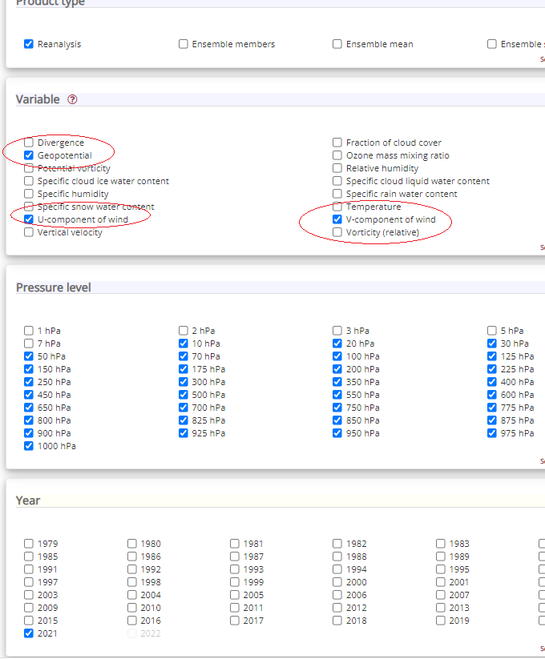
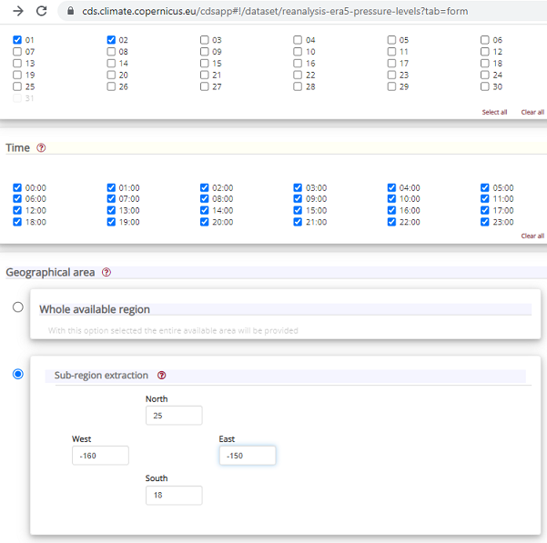
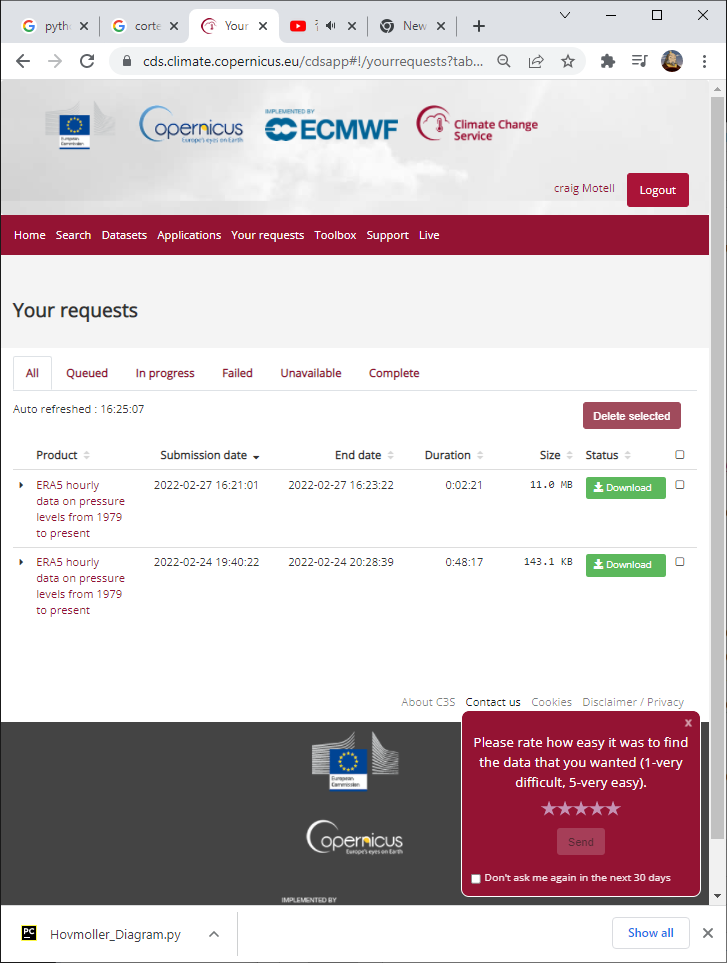

==========================
Downloading ERA5 Forecasts
==========================

.. important::
	Note From September 26, 2024, the `legacy CDS and legacy ADS <https://confluence.ecmwf.int/display/CKB/Please+read%3A+CDS+and+ADS+migrating+to+new+infrastructure%3A+Common+Data+Store+%28CDS%29+Engine>`_ 
	are decommissioned and no longer accessible. CDS-Beta and ADS-Beta have officially become the new CDS and the new ADS. The new CDS and ADS also use 
	an `updated GRIB to netCDF conversion <https://confluence.ecmwf.int/display/CKB/GRIB+to+netCDF+conversion+on+new+CDS+and+ADS+systems>`_, 
	which causes slight differences in both formatting and data. 

	EarthSHAB still expects the Pre Sep 2024 ERA5 structure for running trajectories.  Use the `ERA5-Utils toolkit <https://github.com/tkschuler/ERA5-Utils>`_ to convert the new 
	CDS ERA5 files into the expected format. This toolkit can also be used to download Complete ERA5 reanalysis (more pressure levels) via API.
 

Overview
--------

**ERA5** is ECMWF’s fifth-generation global atmospheric reanalysis dataset, providing hourly estimates of
atmospheric variables from 1979 to present.

Reanalysis combines numerical weather prediction models with observational data to produce a physically
consistent estimate of the atmosphere over time. ERA5 is the standard benchmark for historical analysis
and trajectory simulations.

ERA5 reanalysis data from the European Centre for Medium-Range Weather Forecasts (ECMWF) is accessed via the
`Copernicus Climate Data Server <https://cds.climate.copernicus.eu/datasets/reanalysis-era5-pressure-levels?tab=download>`_.

Required Variables
------------------

EarthSHAB requires the following variables across **all pressure levels**:

- Geopotential (``z``)
- U-component of wind (``u``)
- V-component of wind (``v``)
- Temperature (``t``)

.. note::
   ERA5 data is available at **hourly resolution**, which provides finer temporal fidelity
   than GFS (typically 3-hour intervals).

Let's say you want data over the Hawaiian Islands for January 1-2, 2021, then a typical selection would look like:

Be sure to select **NetCDF (experimental)** for the download format to use with EarthSHAB.

The data download request is then added to a queue and can be downloaded a later time (typically only takes a few minutes). Save the netcdf reanalysis file to the *forecast directory* and feel free to rename the file to something more useful.

.. note:: ECMWF reanalysis data is available every hour unlike GFS which is avilable in 3 hour increments. 

The download option will look like the following: 

