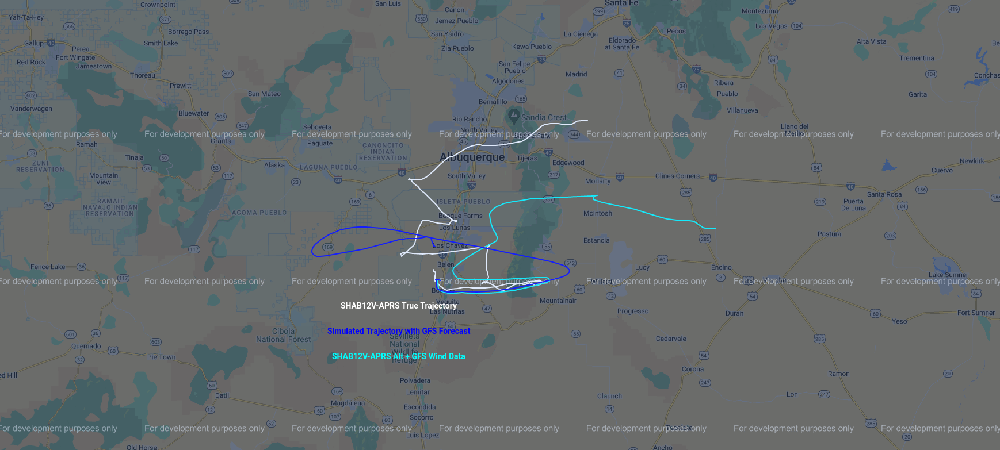
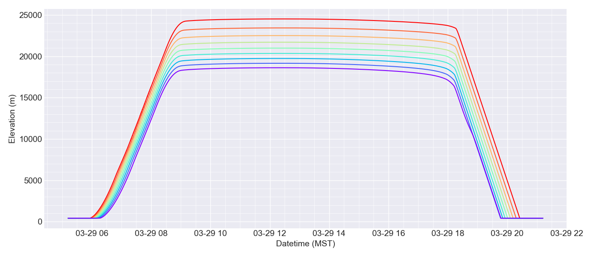
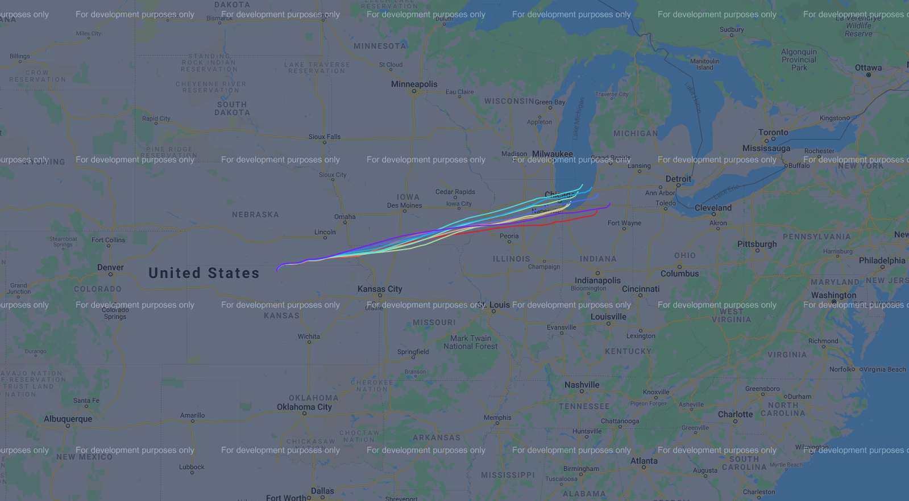

.. _examples-index:

###################
EarthSHAB Usage
###################

.. toctree::
   :maxdepth: 1
   :caption: Downloading and Saving Forecasts:

   downloadGFS
   downloadERA5

Quick Start
===========

1. **Install EarthSHAB**: :doc:`../installation`  
2. **Download weather data** via :doc:`downloadGFS` or :doc:`downloadERA5`
3. **Edit the configuration file** (``config.py``)  
4. **Run a simulation**

``main.py`` *will run as is with the provided examples GFS and ERA5 forecasts*.  From the parent directory: run 

.. code-block:: bash

   python3 -m EarthSHAB.main

You should see:

- Altitude vs time plots  
- Temperature profiles  
- 3D wind/atmosphere visualization  
- Interactive trajectory map  (html file in /trajectories directory)

.. note::
   **New** since version v1.1, ``main.py`` supports comparing simulations (using either a GFS forecast or ERA5 renalysis) to a historical balloon flight. At this time, only balloon trajectories in the *aprs.fi* format are supported. Flights using APRS devices for real time tracking can be downloaded after landing from  `APRS.fi <https:aprs.fi>`_.  To use this functionality, change ``balloon_trajectory`` in the configuration file from None to a filename.

|pic0|

Configuration File
===================

``config.py`` is the **central control file** for all EarthSHAB simulations. In most cases, this is the *only file you need to modify*.

Many parameters can be adjusted for running EarthSHAB simulations and the parameters are grouped together into convienent categories:

- **balloon_properties:** includes parameters for adjusting the balloon size and material propeties.  Currently only the 'sphere' shape is supported.  If using a standard 6 m charcoal-coated SHAB balloon, the payload and envelope masses are the only parameters that need to be updated. 
- **netcdf_gfs:** includes parameters for reading and saving GFS netcdf forecasts from `NOAA's NOMADS server <https://nomads.ncep.noaa.gov/>`_. Currently only supporting forecasts with a resolution of 0.25 degrees for better trajectroy prediction accuracy. 
- **netcdf_era5:** 
- **simulation:** 
- **forecast_type:** Either GFS or ERA5.  For either to work, a corresponding netcdf file must be download and in the forecasts directory. 
- **GFS.GFSRate:** adjusts how often wind speeds are looked up (default is once per 60 seconds). The fastest look up rate is up to 1.0 s, which provides the highest fidelity predictions, but also takes significantly longer to run a simulation.  
- **dt:** is default to 1.0 s integrating intervals.
- **earth_properties:** include mostly constant proeprties for earth.  These values typically don't need to be changed, however the ground emissivity and albedo might be changed if predicting balloon launches over oceans or snow covered locations. 

.. tip:: 
   If when increasing ``dt``, NaNs are introduced,  this is a numerical integration issue that can be solved by decreasing dt. Most values over 2.5 s cause this issue when running a simulation. 

Other Examples
===================

``python3 -m EarthSHAB.predict`` uses EarthSHAB to generate a collection of altitude and trajectory predictions at different float altitudes. Estimating float altitudes for a standard charcoal SHAB balloon are challenging and can range from SHAB to SHAB even if all the **balloon_properties** are the same and the balloons are launches on the same day. This example produces a rainbow altitude plot and interactive google maps trajectory prediction. The float altitudes are adjusted by changing the payload mass in .25 increments to simulate varrying float altitudes.

|pic1| |pic2|

``python3 -m EarthSHAB.trapezoid`` provides a rough example of how to use EarthSHAB with a manual altitude profile to estimate wind-based trajectory predictions.  Alternatively, you can generate a csv file in the *aprs.fi* format and inclue it in ``config.py``. 
